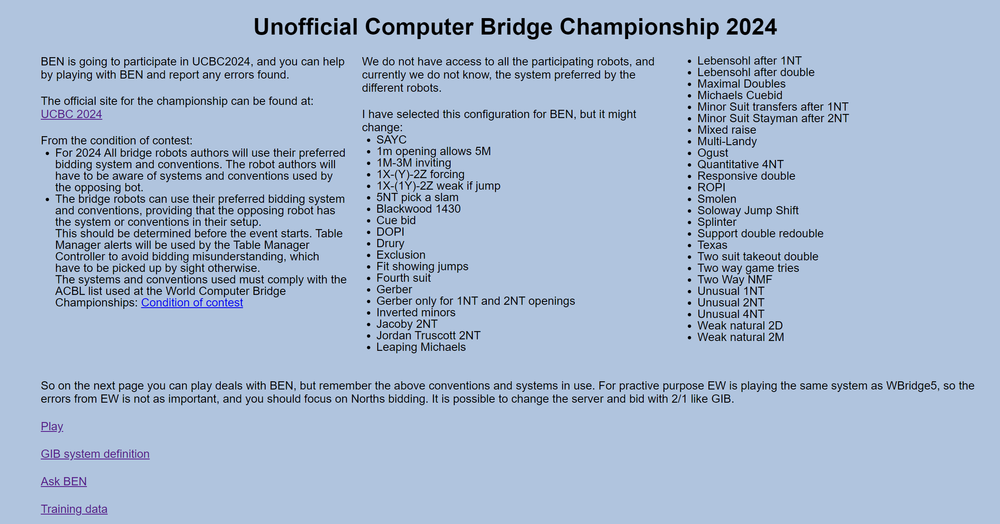

# Using the BEN API

You can set up BEN as an api-server, where you can ask BEN for Bid or Play in any situation, but be aware, that BEN must have a system matching the meaning of the bids, otherwise the results might be bad.

To start the server just type

```
python gameapi.py
```

The api is using default_api.conf as configuration, but i can be overridden by the --config parameter

The api will listen on port 8085 as default, but it can be overridden by the --port parameter

To test the api, you can start the appserver, and use the "Ask BEN" 



The Api is a stateless api, so you must provide all information from the beginning to BEN to get the correct answer.

All input is based on Querystring (will probably be changed to json post at some time), and the response is a json object.

An example:

Dealer North
None vulnerable

You are sitting South with

-    AK97543
-    K
-    T3
-    AK7

And would like to know what BEN would bid, after the first two hands both pass

So you create the following url

http://your_server:8085/bid?user=Thorvald&dealer=N&seat=S&vul=&ctx=----&hand=AK97543.K.T3.AK7&dummy=&played=&tournament=

There are 3 interesting operations on the server

/bid
/lead
/play

The parameters are:

- ctx bidding replaceing pass with -- , double is Db and Redouble is Rd
- hand the hand for BEN in PBN-notation
- user name of the user asking or something unique
- dealer N,S,E or W
- seat  N,S,E or W
- vul blank if no vulnerable @v if NS vulnerable @V if EW vulnerable and @v@V if both vulnerable
- dummy the hand for dummy in PBN-notation
- played the list of cards played like SJSQSKSA
- tournament value mp if matchpoint otherwise it will be Imps

Not all is mandatory for all 3 operations, just what makes sense

Ok, but let us the look at the response:
```
{"bid": "1S", 
"who": "NN", 
"candidates": [
    {"call": "1S", "insta_score": 0.998}], 
    "hcp": [9.2, 7.3, 6.5], 
    "shape": [1.9, 4.0, 3.7, 3.3, 2.4, 3.9, 3.5, 3.2, 2.2, 3.9, 3.6, 3.3]}
```
So BEN is not in doubt, this is a 1S opening

If more than one bid could be considered, the list of candidates would be longer, and for each candidate there can be generated samples for how the board might look based on the current bidding.

When the bidding is done you can call the action /lead to get an opening lead. A response could look like this:
```
{
    "card": "CA", 
    "who": "Simulation (MP)", 
    "quality": "Good", 
    "hcp": [7.7, 2.5, 12.4], 
    "shape": [0.8, 4.3, 4.2, 3.7, 0.4, 4.6, 4.1, 3.9, 7.0, 2.2, 2.0, 1.9], 
    "candidates": [
        {"card": "CA", "insta_score": 0.325, "expected_tricks_sd": 5.28, "p_make_contract": 1.0, "expected_score_sd": 236}, 
        {"card": "CK", "insta_score": 0.276, "expected_tricks_sd": 5.28, "p_make_contract": 1.0, "expected_score_sd": 236}, 
        {"card": "HK", "insta_score": 0.273, "expected_tricks_sd": 5.33, "p_make_contract": 1.0, "expected_score_sd": 233}, 
        {"card": "DT", "insta_score": 0.065, "expected_tricks_sd": 5.41, "p_make_contract": 1.0, "expected_score_sd": 230}], 
        "samples": [
            "AK9xxxx.K.Tx.AKx J.QJ9x.A98x.xxxx Q.8xxxx.QJxx.QT9 T8xx.ATx.Kxx.J8x 0.74974", 
            "AK9xxxx.K.Tx.AKx x.AJxx.9xxx.JT9x .T9xxx.QJ8.Q8xxx QJT8x.Q8x.AKxx.x 0.73924", 
            "AK9xxxx.K.Tx.AKx 8.QT8xx.KQxxx.xx QJ.J9x.8xx.QJ98x Txx.Axxx.AJ9.Txx 0.74969", 
            "AK9xxxx.K.Tx.AKx 8.QJxx.A9xx.8xxx J.Txxx.KQJ8x.QJ9 QTxx.A98x.xx.Txx 0.74518", 
            "AK9xxxx.K.Tx.AKx x.JTxx.AQxx.Qxxx Q.Q8xx.KJxx.JT98 JT8x.A9xx.98x.xx 0.74995", 
            "AK9xxxx.K.Tx.AKx J8.ATx.J9x.QJxxx .Q98xx.Axxx.T9xx QTxx.Jxxx.KQ8x.8 0.74787", 
            "AK9xxxx.K.Tx.AKx .98xx.AK8x.QJT9x .QJxx.Qxxxx.8xxx QJT8xx.ATxx.J9.x 0.72345", 
            "AK9xxxx.K.Tx.AKx .AQxx.Q98xx.QT9x T.J98xxx.xxx.8xx QJ8xx.Tx.AKJ.Jxx 0.74054", 
            "AK9xxxx.K.Tx.AKx .T9xxx.AKxx.T9xx J.AJxx.QJ98.Qxxx QT8xx.Q8x.xxx.J8 0.73949", 
            "AK9xxxx.K.Tx.AKx T.xx.AKJ9x.Q8xxx J.AQTxx.Qxxx.T9x Q8xx.J98xx.8x.Jx 0.73921", 
            "AK9xxxx.K.Tx.AKx x.QJ9xx.J8x.Q98x .T8xxx.KQ9xx.xxx QJT8x.Ax.Axx.JTx 0.74379", 
            "AK9xxxx.K.Tx.AKx x.AJx.QJ98x.T8xx T.QT8xx.xx.J9xxx QJ8x.9xxx.AKxx.Q 0.74960", 
            "AK9xxxx.K.Tx.AKx Q.Jxxx.AQ98x.xxx .Q98xx.Kxxxx.JTx JT8xx.ATx.J.Q98x 0.74266", 
            "AK9xxxx.K.Tx.AKx x.xxx.AQxxx.Txxx T.AT9xx.8xx.Q98x QJ8x.QJ8x.KJ9.Jx 0.74816", 
            "AK9xxxx.K.Tx.AKx .Q9xx.KJxxx.98xx J.8xxx.AQ98x.Txx QT8xx.AJTx.x.QJx 0.74260", 
            "AK9xxxx.K.Tx.AKx x.AQ8x.Axxxx.8xx T.T9xxx.QJx.QT9x QJ8x.Jxx.K98.Jxx 0.73138", 
            "AK9xxxx.K.Tx.AKx .8xxxx.AQJ9x.Jxx .QTxx.xxxx.Q98xx QJT8xx.AJ9.K8.Tx 0.74815", 
            "AK9xxxx.K.Tx.AKx .Jxxx.AQ9xx.T9xx .T8xx.Jxxx.QJ8xx QJT8xx.AQ9x.K8.x 0.74835", 
            "AK9xxxx.K.Tx.AKx x.ATxxx.K9xx.8xx .J98xx.J8x.QJxxx QJT8x.Qx.AQxx.T9 0.74635", 
            "AK9xxxx.K.Tx.AKx .JTxx.KJ8xx.QJxx Tx.Q8xx.9xx.T98x QJ8x.A9xx.AQx.xx 0.74990"]}

```

So also here you get a lot of information about possible cards, and some statistics for each card, but you can also just use the card suggested by BEN

And finally during play, you use the action /play and each time send all the cards in play order (The api is stateless) and you will get a response like the above

### What can the Api be used for?

You cvan use it to serve as robot for play sites, but you can also use it to give players hints, when they are in doubt. Some might find it interesting to look at the generated samples for more complex bidding.
